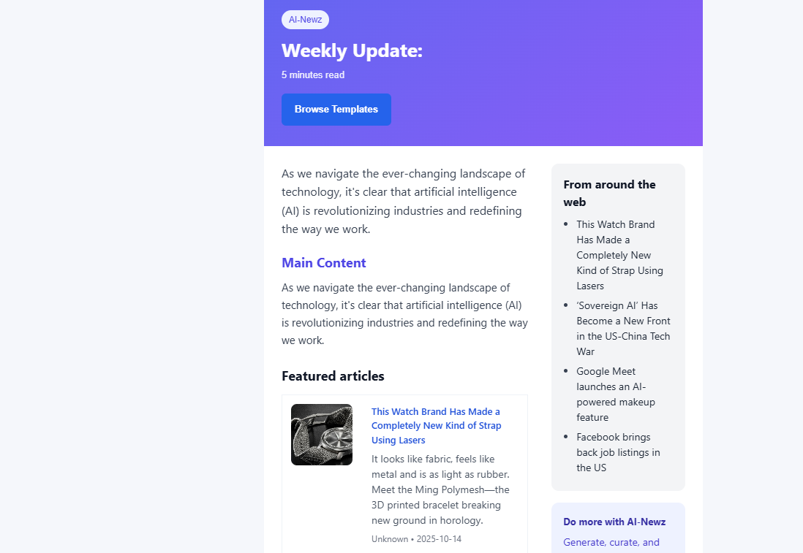

# AI-Newz - AI-Powered Newsletter Generator

> Transform RSS feeds into personalized newsletters with AI. Built with FastAPI, Next.js, and Groq.



---

## The Problem

Creating newsletters is time-consuming. Finding content, writing summaries, formatting emails — it takes hours every week.

## The Solution

AI-Newz automates the entire pipeline:
1. **Fetch** — Pull articles from your RSS feeds
2. **Curate** — AI selects the most relevant content
3. **Generate** — Create engaging summaries and headlines
4. **Send** — Publish directly to your subscribers

---

## Live Demo

[Coming soon]

---

## Tech Stack

### Backend
| Layer | Technology |
|-------|------------|
| **Framework** | FastAPI (Python 3.11+) |
| **Database** | Supabase (PostgreSQL) |
| **AI** | Groq API (Llama 3.1 70B) |
| **Email** | Resend API |
| **Auth** | Google OAuth + JWT |

### Frontend
| Layer | Technology |
|-------|------------|
| **Framework** | Next.js |
| **Language** | TypeScript |
| **Styling** | Tailwind CSS |
| **Components** | Custom responsive components |

---

## Features

### Content Pipeline
- **RSS Integration** — Add any RSS feed as a content source
- **Smart Curation** — AI ranks articles by relevance
- **Summary Generation** — Engaging summaries, not just excerpts
- **Trending Topics** — Discover what's hot in your niche

### Newsletter Creation
- **Template System** — Beautiful, responsive email templates
- **Preview Mode** — See exactly what subscribers receive
- **Direct Publishing** — Send with one click via Resend

### User Experience
- **Google OAuth** — Sign in without passwords
- **Personal Dashboard** — Track all your newsletters
- **Analytics** — Engagement metrics per newsletter

---

## Architecture

```
┌─────────────────────────────────────────────────────────────┐
│                     Next.js Frontend                         │
│   Dashboard · Newsletter Editor · Analytics                  │
└─────────────────────────┬───────────────────────────────────┘
                          │ REST API
                          ▼
┌─────────────────────────────────────────────────────────────┐
│                     FastAPI Backend                          │
│   ┌─────────────┐  ┌─────────────┐  ┌─────────────┐        │
│   │  RSS Feed   │  │  AI Content │  │   Email     │        │
│   │  Parser     │  │  Generator  │  │   Sender    │        │
│   └─────────────┘  └─────────────┘  └─────────────┘        │
└─────────────────────────┬───────────────────────────────────┘
                          │
        ┌─────────────────┼─────────────────┐
        ▼                 ▼                 ▼
   ┌─────────┐      ┌─────────┐      ┌─────────┐
   │ Supabase│      │  Groq   │      │ Resend  │
   │   DB    │      │   AI    │      │  Email  │
   └─────────┘      └─────────┘      └─────────┘
```

---

## API Endpoints

### Authentication
```
POST /api/v1/auth/login      — User login
POST /api/v1/auth/register   — User registration
GET  /api/v1/auth/me         — Get current user
```

### RSS Feeds
```
GET  /api/v1/rss/sources     — List RSS sources
POST /api/v1/rss/sources     — Add new RSS source
GET  /api/v1/rss/articles    — Get articles from feeds
```

### Newsletters
```
GET  /api/v1/newsletters           — List user newsletters
POST /api/v1/newsletters/generate  — Generate new newsletter
POST /api/v1/newsletters/publish   — Publish to subscribers
```

---

## Project Structure

```
AI-Newsletter/
├── app/                    # FastAPI backend
│   ├── api/               # API routes
│   ├── core/              # Config, security
│   ├── models/            # Database models
│   ├── schemas/           # Pydantic schemas
│   └── services/          # Business logic
├── frontend/              # Next.js frontend
│   ├── src/
│   │   ├── app/          # Pages
│   │   ├── components/   # React components
│   │   └── lib/          # Utilities
│   └── public/           # Static assets
├── alembic/               # Database migrations
└── docs/                  # Documentation
```

---

## Run Locally

### Backend
```bash
# Create virtual environment
python -m venv venv
source venv/bin/activate  # Windows: venv\Scripts\activate

# Install dependencies
pip install -r requirements.txt

# Set environment variables
cp .env.sample .env
# Edit .env with your API keys

# Run database migrations
alembic upgrade head

# Start server
python app/main.py
```

### Frontend
```bash
cd frontend
npm install
npm run dev
```

Open [http://localhost:3000](http://localhost:3000)

---

## UX Decisions

### Why FastAPI + Next.js?
- FastAPI for async AI processing (long-running LLM calls)
- Next.js for fast, SEO-friendly frontend
- Clear separation of concerns

### Email Template System
- Responsive design (works on all email clients)
- Preview before sending (no surprises)
- One-click publish (reduce friction)

### AI Integration
- Groq for speed (faster than OpenAI for this use case)
- Streaming responses for perceived performance
- Fallback to cached content if AI fails

---

## Environment Variables

```bash
# AI
GROQ_API_KEY=your_groq_api_key

# Database
SUPABASE_URL=your_supabase_url
SUPABASE_ANON_KEY=your_supabase_anon_key
SUPABASE_SERVICE_ROLE_KEY=your_service_role_key

# Email
RESEND_API_KEY=your_resend_api_key

# Auth
GOOGLE_CLIENT_ID=your_google_client_id
GOOGLE_CLIENT_SECRET=your_google_client_secret
JWT_SECRET_KEY=your_jwt_secret
```

---

## Deployment

### Docker
```bash
docker compose up -d
```

### Manual
See [DOCKER_DEPLOYMENT_GUIDE.md](./DOCKER_DEPLOYMENT_GUIDE.md)

---

## What I Learned

- Building async pipelines for AI content generation
- Email template design that works across clients
- OAuth integration with JWT token refresh

---

## Future Improvements

- [ ] Schedule newsletters (cron-based)
- [ ] A/B testing for subject lines
- [ ] Subscriber management UI
- [ ] Multiple newsletter templates
- [ ] Webhook for new subscriber events

---

Built by [Allan D'Souza](https://allan-portfolio.framer.website/) | [GitHub](https://github.com/allands365-hub)
